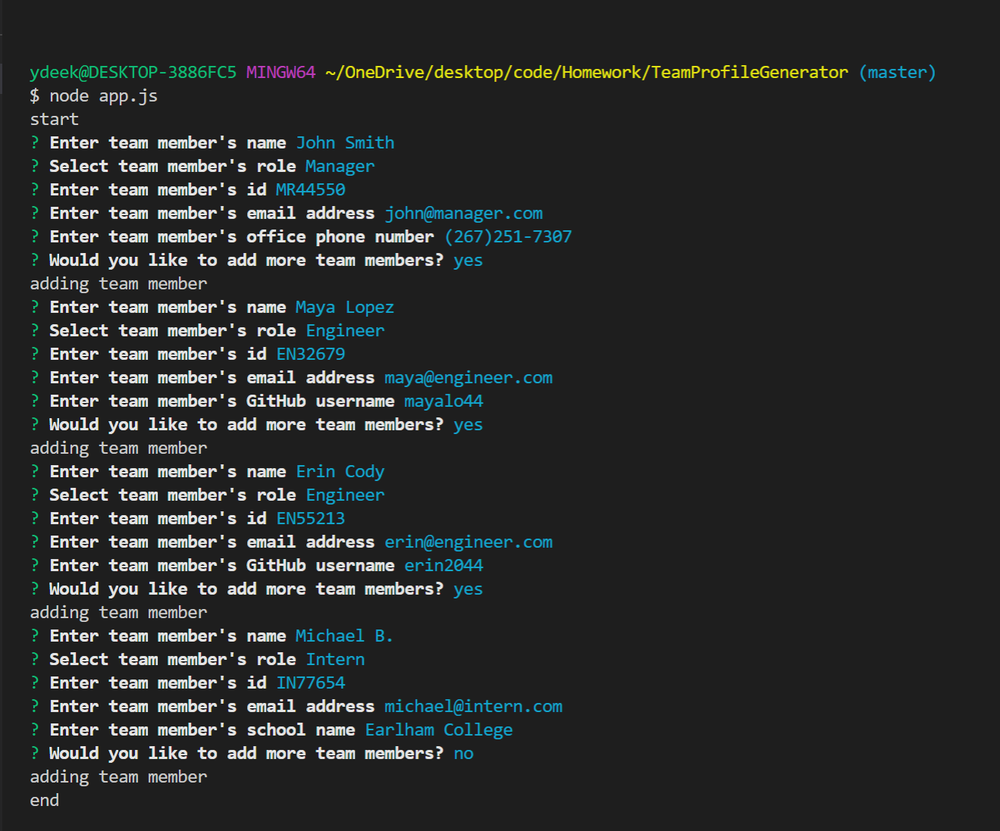
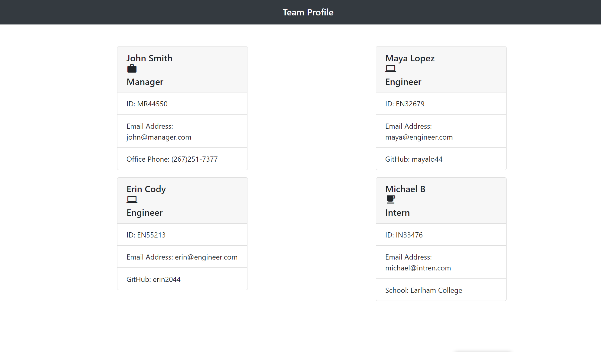
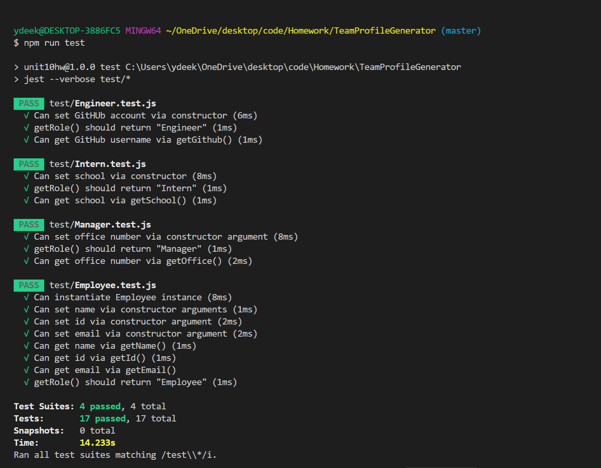

# Team Profile Generator

## Project Discription 

The Team Profile Generator is a command-line-input application that runs in Node js. This application asks users for employees’ information such as manager, Engineer, and intern and generates HTML file to display the information. Upon the launch of the application users are asked with some questions about the employee information. 

